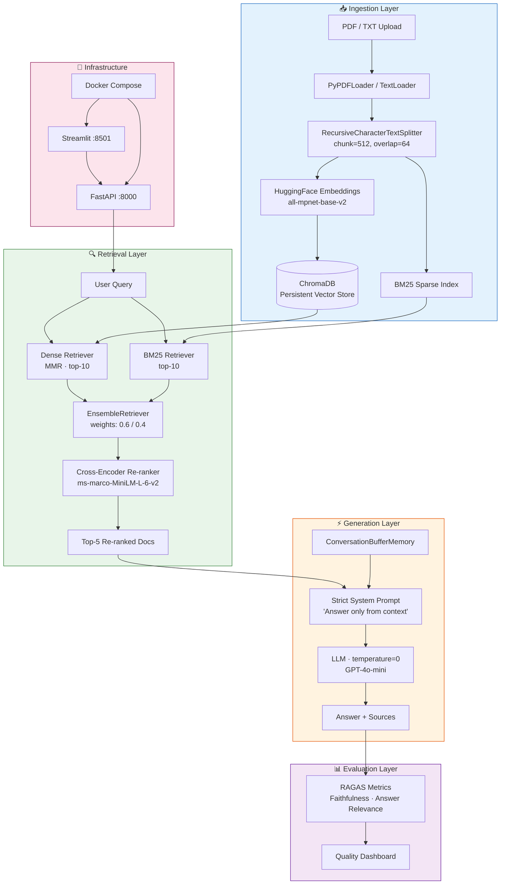

# 🧠 Enterprise RAG Pipeline

> **Author:** Akmal Raxmatov · [github.com/thed700](https://github.com/thed700)  
> **Stack:** LangChain · ChromaDB · FastAPI · Streamlit · Docker

A production-ready Retrieval-Augmented Generation system with **Hybrid Search**, **Cross-Encoder Re-ranking**, and strict hallucination prevention — built to enterprise software standards.

---

## Architecture Diagram



---

## 🗂️ Project Structure

```
rag-enterprise-system/
├── app/
│   ├── main.py          # FastAPI server (ingest, query, health endpoints)
│   ├── engine.py        # RAG core: Hybrid Search + Re-ranking + LLM
│   ├── ui.py            # Streamlit dashboard
│   ├── utils.py         # Logging, Settings (pydantic-settings)
│   └── models.py        # Pydantic request/response schemas
├── data/                # Sample PDFs + ChromaDB persistence
├── tests/
│   └── test_engine.py   # Pytest unit tests (mocked dependencies)
├── Dockerfile
├── docker-compose.yml
├── .env.example         # Environment variable template
├── .gitignore
├── requirements.txt
└── README.md
```

---

## 🚀 Quick Start

### 1. Clone & Configure

```bash
git clone https://github.com/thed700/enterprise-rag-pipeline.git
cd enterprise-rag-pipeline
cp .env.example .env
# Edit .env → set your OPENAI_API_KEY
```

### 2. Run with Docker (Recommended)

```bash
docker compose up --build
```

| Service | URL |
|---------|-----|
| FastAPI docs | http://localhost:8000/docs |
| Streamlit UI | http://localhost:8501 |

### 3. Run Locally (Development)

```bash
python -m venv .venv && source .venv/bin/activate
pip install -r requirements.txt

# Terminal 1 — API
uvicorn app.main:app --reload --port 8000

# Terminal 2 — UI
streamlit run app/ui.py
```

### 4. Run Tests

```bash
pytest tests/ -v
```

---

## 🔑 Key Design Decisions

| Decision | Choice | Reason |
|----------|--------|--------|
| Embedding model | `all-mpnet-base-v2` | Best-in-class semantic quality, runs on CPU |
| Retrieval | Hybrid (Dense + BM25) | Dense catches semantics; BM25 catches exact terms/names |
| Re-ranking | Cross-Encoder `ms-marco-MiniLM-L-6-v2` | Precision boost over bi-encoder retrieval alone |
| LLM temperature | `0` | Deterministic, factual, reproducible output |
| Memory | `ConversationBufferMemory` | Simple per-session context; swap Redis for multi-user |
| Evaluation | RAGAS | Measures Faithfulness + Answer Relevance without labelled data |

---

## 📊 Evaluation with RAGAS

```python
from ragas import evaluate
from ragas.metrics import faithfulness, answer_relevancy

# Build a dataset of {question, answer, contexts}
result = evaluate(dataset, metrics=[faithfulness, answer_relevancy])
print(result)
# → {'faithfulness': 0.94, 'answer_relevancy': 0.88}
```

---

## 🔒 Security Checklist

- [x] API keys in `.env`, never hardcoded
- [x] `.gitignore` excludes `.env` and model caches
- [x] Pydantic validation on all API inputs
- [x] No user data persisted beyond ChromaDB

---

## 📦 Package for Transfer

```bash
tar -cJf rag-system-project.tar.xz rag-enterprise-system/
```

---

## API Reference

### `POST /ingest`
Upload PDF or TXT files for indexing.

### `POST /query`
```json
{ "question": "What is the refund policy?", "top_k": 5 }
```

### `GET /health`
Returns vector store and BM25 index status.

### `DELETE /memory`
Clears conversation history for a fresh session.
